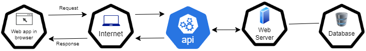

# Working with APIs

## 1. What are APIs? How are they used and why are they so popular?

An API (Application Programming Interface) is a set of rules and protocols that allows different software applications to communicate with each other. APIs are used to access and manipulate the functionality of other software systems, services, or data. They are popular because they enable developers to leverage existing services and functionalities to build new applications more quickly and efficiently.

## 2. Data Transfer Process in API Communication

## What is a REST API?
A REST API, or Representational State Transfer Application Programming Interface, is a type of web service that follows the principles of the REST architectural style. REST APIs are designed to be stateless, scalable, and loosely coupled, making them suitable for distributed systems and web-based applications.

## What Makes an API RESTful?
To be considered RESTful, an API must adhere to several key principles:

1. **Client-Server Architecture**: A clear separation between client and server concerns, where clients are not concerned with the implementation details of the server and vice versa. This separation enables independent evolution of both client and server components.

2. **Statelessness**: Each request from a client to the server must contain all the information necessary to understand and fulfill that request. The server does not maintain any client state between requests, making each request independent.

3. **Uniform Interface**: The API should have a uniform and consistent interface that simplifies communication between clients and servers. This includes the use of standard HTTP methods (GET, POST, PUT, DELETE) for different operations and adherence to standard data formats like JSON or XML for data exchange.

4. **Resource-Based**: Resources are the fundamental concept in RESTful APIs. Resources are identified by URIs (Uniform Resource Identifiers), and clients interact with resources through standard HTTP methods to perform CRUD (Create, Read, Update, Delete) operations.

5. **Representation**: Resources can have multiple representations, such as JSON, XML, HTML, or others. Clients can specify the desired representation using content negotiation (e.g., using the `Accept` header), and servers respond with the appropriate representation.

## REST API Guidelines:
While there are no strict rules for building RESTful APIs, following some best practices and guidelines can help ensure consistency, scalability, and ease of use:

1. **Use Nouns for Resource Names**: Use descriptive nouns for resource names in the URI. For example, `/users` for a collection of users and `/users/{id}` for a specific user.

2. **Use HTTP Methods Correctly**: Use HTTP methods according to their intended semantics. For example, use `GET` for fetching resources, `POST` for creating new resources, `PUT` for updating existing resources, and `DELETE` for deleting resources.

3. **Provide Consistent Responses**: Ensure that API responses are consistent in structure and format. Use standard HTTP status codes to indicate the outcome of each request (e.g., 200 for success, 404 for not found, 500 for server error).

4. **Versioning**: Consider versioning your API to provide backward compatibility and allow for future changes without breaking existing clients. You can include version information in the URI (e.g., `/api/v1/users`) or use custom headers.

5. **Authentication and Authorization**: Implement secure authentication and authorization mechanisms to protect your API from unauthorized access and misuse. Use standards like OAuth or API keys for authentication.

6. **Documentation**: Provide comprehensive documentation for your API, including endpoints, request/response formats, authentication requirements, and usage examples. Clear documentation helps developers understand and use your API effectively.

By adhering to these principles and guidelines, you can design RESTful APIs that are easy to understand, use, and maintain, promoting interoperability and scalability in distributed systems.

## 4. What is HTTP?

HTTP stands for Hypertext Transfer Protocol. It is an application layer protocol used for transmitting hypermedia documents, such as HTML. HTTPS (HTTP Secure) is a secure version of HTTP that uses encryption (SSL/TLS) to ensure secure communication over the internet.

## 5. HTTP Request Structure

Explanation:
1. **VERB**: This column indicates the HTTP method or verb being used in the request. Common HTTP methods include:
   - GET: Used to retrieve data from the server.
   - POST: Used to submit data to the server, often to create a new resource.
   - PUT: Used to update or replace an existing resource on the server.
   - DELETE: Used to delete a resource from the server.

2. **URL**: This column specifies the Uniform Resource Locator (URL) of the resource being requested. The URL typically includes the protocol (e.g., "http://" or "https://"), domain name or IP address, port number (if not default), and the path to the resource on the server.

3. **Version**: This column indicates the version of the HTTP protocol being used. For example, "HTTP/1.1" or "HTTP/2.0".

4. **Header**:
   - The "Header" row represents the section of the request where additional metadata is provided.
   - Under "Key Value Pairs", the request headers are listed as key-value pairs.
   - Each header consists of a key and a corresponding value. Headers provide information such as the content type, encoding, authentication credentials, and more.

5. **Body**:
   - The "Body" row represents the section of the request where the payload or data being sent to the server is included.
   - Under "Text", "JSON", and "XML", different data formats that can be included in the request body are listed.
   - The "Text" format typically includes plain text data.
   - The "JSON" format represents data in JavaScript Object Notation format.
   - The "XML" format represents data in Extensible Markup Language format.

## 6. HTTP Response Structure

Explanation:
1. **Response Code**: This indicates the status code returned by the server in response to the request. Common status codes include:
   - 200 OK: The request was successful.
   - 404 Not Found: The requested resource was not found on the server.
   - 500 Internal Server Error: The server encountered an unexpected condition that prevented it from fulfilling the request.

2. **HTTP Version**: This indicates the version of the HTTP protocol used in the response. It typically includes the protocol version number, such as "HTTP/1.1" or "HTTP/2.0".

3. **Header**:
   - The "Header" row represents the section of the response where additional metadata is provided.
   - Under "Key Value Pairs", the response headers are listed as key-value pairs.
   - Each header consists of a key and a corresponding value. Headers provide information such as the content type, encoding, and server details.

4. **Body**:
   - The "Body" row represents the section of the response where the payload or data sent by the server is included.
   - Under "Text", "JSON", and "XML", different data formats that can be included in the response body are listed.
   - The "Text" format typically includes plain text data.
   - The "JSON" format represents data in JavaScript Object Notation format.
   - The "XML" format represents data in Extensible Markup Language format.

## 7. What are the 5 HTTP verbs? And what does each do?

The five HTTP verbs are:
- GET: Retrieve data from a specified resource.
- POST: Submit data to be processed to a specified resource.
- PUT: Update a specified resource.
- DELETE: Delete a specified resource.
- PATCH: Apply partial modifications to a resource.

## 8. What is "statelessness"? 

Statelessness means that the server does not store any client state between requests. Stateless HTTP requests do not rely on previous requests, each request is independent. Examples of stateless HTTP requests include fetching data from an API and submitting a form with all necessary data included in the request. Stateful HTTP requests, on the other hand, rely on previous interactions to determine the response. Examples include sessions where the server stores client state between requests.

### Stateless HTTP Requests:
1. **Retrieving News Articles**:
   - Example: A user visits a news website and requests to view the latest articles in a specific category, such as technology or sports.
   - Explanation: Each request to fetch news articles includes all the necessary information, such as the category, page number, and any filters. The server responds with the requested articles without relying on any previous interactions.

2. **Weather Forecast Inquiry**:
   - Example: A mobile app sends a request to an external weather API to retrieve the current weather forecast for a particular location.
   - Explanation: The app includes the location details (e.g., latitude and longitude) in the request to fetch the weather forecast. The server processes the request independently for each inquiry, providing the current weather information for the specified location.

### Stateful HTTP Requests:
1. **Online Banking Transactions**:
   - Example: A user logs in to their online banking account and initiates a fund transfer to another account.
   - Explanation: The user's authentication status and transaction history are maintained by the server throughout the session. Each transaction request includes the necessary authentication tokens and transaction details, and the server ensures consistency and security by referencing the user's session data.

2. **Social Media Interactions**:
   - Example: A user interacts with a social media platform by liking a post, commenting on a photo, or sharing a link.
   - Explanation: The server keeps track of the user's profile, connections, and activity history. Each interaction request (e.g., liking a post) relies on the user's previous interactions and preferences stored by the server to personalize the user experience.

## 9. What is caching?

Caching is the process of storing copies of files or data in a cache to serve future requests more quickly. In the context of web applications, caching can occur at various levels including client-side caching (browser cache) and server-side caching (proxy servers, CDN). Caching helps reduce latency, server load, and bandwidth usage by serving previously generated or stored data instead of re-fetching it from the original source.
