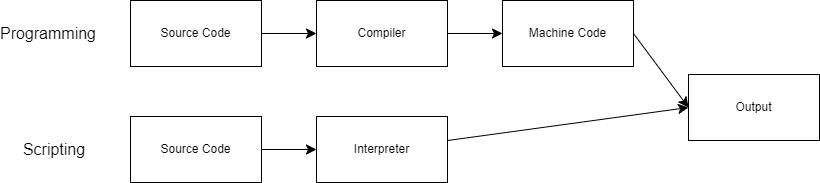

iii
# Scripting in Python

## What is scripting?

Scripting refers to the process of writing scripts, which are small programs that automate tasks or perform specific functions. Scripting is often used for tasks that are repetitive or require automation, such as system administration, data processing, and task automation. 

### How is it different from programming?

While scripting and programming both involve writing code to instruct a computer to perform tasks, there are some key differences:

- **Size and Complexity:** Scripts are typically smaller and less complex than full-fledged programs. They are often written to perform specific tasks or automate simple processes.
- **Interpretation:** Scripts are usually interpreted rather than compiled. This means they are executed directly by an interpreter, without the need for compilation.
- **Usage:** Scripts are commonly used for automation, system administration, and other tasks that require quick and simple solutions. Programs, on the other hand, may be larger and more complex, designed for broader applications.

### Visual Representation



## Packages in the Standard Python Library

The Python standard library includes a wide range of packages and modules for various purposes. Here are some examples along with code snippets demonstrating their usage:

### 1. `os` - Operating System Interface

```python
import os

# Get current working directory
current_directory = os.getcwd()
print(current_directory)
# Output: '/path/to/current/directory'
```


### 2. `datetime` - Date and Time Manipulation

```python
from datetime import datetime

# Get current date and time
current_datetime = datetime.now()
print(current_datetime)
# Output: '2024-04-15 12:34:56.789012'
```

### 3. `csv` - CSV File Reading and Writing

```python
import csv

# Read data from a CSV file
with open('data.csv', 'r') as file:
    reader = csv.reader(file)
    for row in reader:
        print(row)
# Output: Contents of the CSV file
```

### 4. `random` - Random Number Generation

```python
import random

# Generate a random integer between 1 and 100
random_number = random.randint(1, 100)
print(random_number)
# Output: Random integer between 1 and 100
```

### 5. sys - System-specific Parameters and Functions

```python
import sys

# Get the version of Python
python_version = sys.version
print(python_version)
# Output: Python version information
```

## List of Python Scripts for DevOps Engineers

Here are some examples of Python scripts that DevOps engineers may use or create:

1. Script to automate server provisioning and configuration using configuration management tools like Ansible or Puppet.
2. Script to monitor server metrics (CPU usage, memory usage, disk space, etc.) and send alerts if thresholds are exceeded.
3. Script to automate log management, including log rotation, archiving, and analysis for troubleshooting and monitoring purposes.
4. Script to automate SSL certificate renewal for web servers and services.
5. Script to automate database backup and restoration tasks for relational databases like MySQL, PostgreSQL, or Oracle.
6. Script to automate deployment and rollback of applications in a microservices architecture using container orchestration tools like Kubernetes or Docker Swarm.
7. Script to automate configuration and deployment of networking equipment such as routers, switches, and firewalls.
8. Script to automate security scanning and vulnerability assessments of servers, applications, and infrastructure.
9. Script to automate the setup and configuration of Continuous Integration/Continuous Deployment (CI/CD) pipelines for software development projects.
10. Script to automate disaster recovery procedures, including failover testing and data replication across geographically distributed servers.

### Bonus: Example Script

Here's an example of a Python script for file backup:

```python
import shutil
import os

def backup_file(source_file, destination_folder):
    # Check if the source file exists
    if not os.path.exists(source_file):
        print(f"Error: Source file '{source_file}' does not exist.")
        return

    # Create the destination folder if it doesn't exist
    if not os.path.exists(destination_folder):
        os.makedirs(destination_folder)

    # Generate the destination file path
    destination_file = os.path.join(destination_folder, os.path.basename(source_file))

    # Copy the source file to the destination folder
    shutil.copyfile(source_file, destination_file)

    print(f"File '{source_file}' backed up to '{destination_file}'.")

# Usage example
backup_file('source_file.txt', 'backup_folder')
```

This script checks if a source file exists, creates a destination folder if it doesn't exist, and then copies the source file to the destination folder for backup. You can replace 'source_file.txt' with the path to the file you want to backup and *'backup_folder' with the path to the folder where you want to store the backup.
